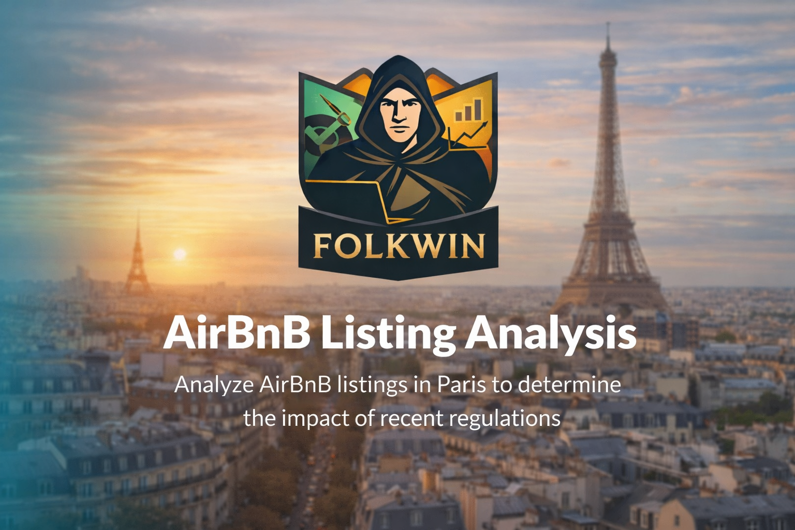

# 🏙️ Paris Airbnb Supply & Pricing Shift After 2015

## 🔥 One-line Story

After the 2015 regulation period, **new Airbnb host/listing growth dropped sharply from its peak**, while **average prices increased again from 2015 to 2020**.

---

## 🎯 Why This Matters

Short-term rental regulation can create a market trade-off:

- 🏠 Protect local housing
- 📉 Slow down new Airbnb supply
- 💰 Increase prices if competition drops

This project analyzes Airbnb listings in Paris to understand what changed around 2015.

---

## 📊 Key Metrics

| Metric | Value |
|---|---:|
| Clean Paris listings analyzed | **64,628** |
| Average nightly price | **€113.20** |
| Median nightly price | **€80.00** |
| Peak year for new hosts/listings | **2015** |
| New hosts/listings in 2015 | **12,147** |
| Average price change, 2015 → 2020 | **+38.5%** |

---

## 📌 Key Findings

### 1. 🗺️ Location drives price

Airbnb prices vary strongly by neighbourhood.

- **Elysee:** €211.37 average price  
- **Menilmontant:** €74.96 average price  

Elysee is almost **2.8x more expensive** than Menilmontant.

---

### 2. 🛏️ Bigger listings are more expensive

In Elysee:

- **2-person listings:** €155.10 average price  
- **6-person listings:** €355.51 average price  

Capacity is a clear pricing driver.

---

### 3. 📉 New host/listing growth slowed after 2015

2015 was the peak year:

- **2015:** 12,147 new hosts/listings

After that peak:

- **2016:** -27.0%
- **2017:** -62.3%
- **2018:** -64.6%
- **2019:** -53.2%

This shows a strong slowdown in market growth after 2015.

---

### 4. 💰 Prices increased after growth slowed

Average price decreased before 2015:

- **2009:** €159.64  
- **2014:** €100.25  
- Change: **-37.2%**

After 2015, average price increased:

- **2015:** €103.65  
- **2020:** €143.52  
- Change: **+38.5%**

This suggests that slower supply growth may have supported higher average prices.

---

## 🧠 Main Takeaway

The Paris Airbnb market changed around 2015.

> **Supply growth peaked in 2015, then slowed sharply. At the same time, average prices rose again until 2020.**

This pattern is consistent with a tighter market: fewer new listings entering, and higher average prices.

---

## 🧭 Recommendations

| Insight | Recommendation |
|---|---|
| Prices vary strongly by neighbourhood | Analyze pricing at neighbourhood level |
| Capacity affects price | Compare listings with similar size |
| New listing growth slowed after 2015 | Track supply growth after regulation |
| Prices rose after growth slowed | Monitor supply and price together |

---

## ⚠️ Limitations

This analysis shows patterns, but it does **not** prove that regulation caused the change.

Other factors may also affect the market:

- Tourism demand
- COVID-19
- Seasonality
- Economic conditions
- Market saturation

Also, yearly trends are based on `host_since`, not historical booking prices.

---

## 🛠️ Tools Used

Python, Pandas, Matplotlib, Seaborn, Jupyter Notebook
